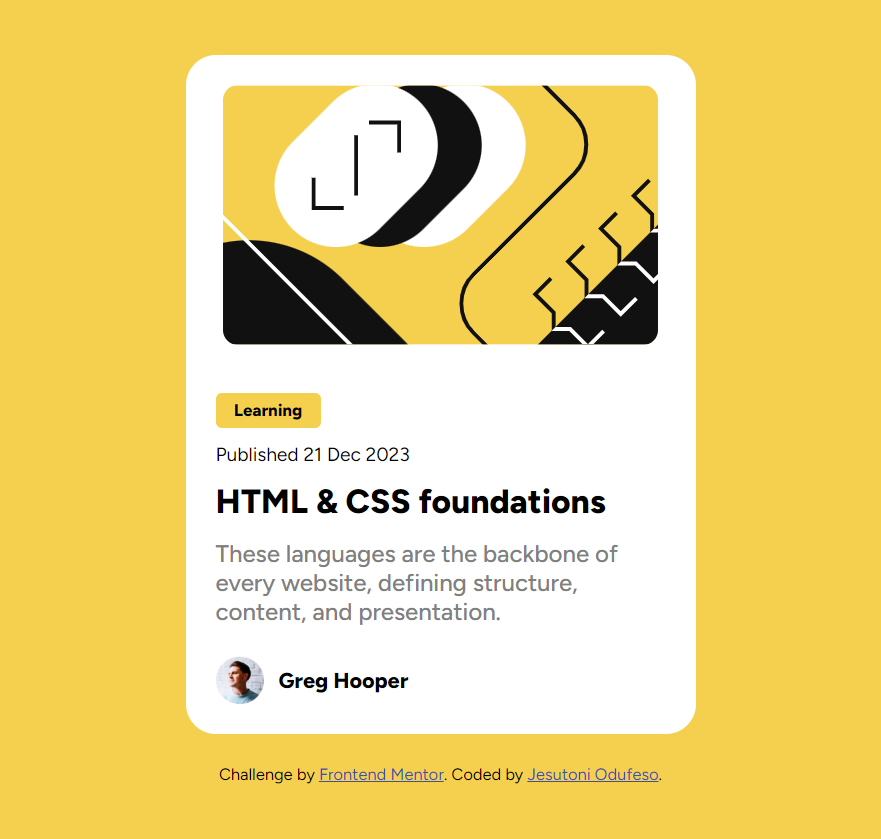
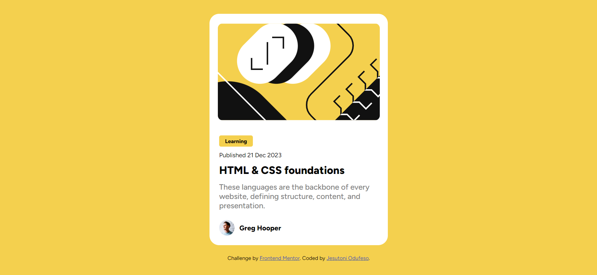

# Frontend Mentor - Blog preview card solution

This is a solution to the [Blog preview card challenge on Frontend Mentor](https://www.frontendmentor.io/challenges/blog-preview-card-ckPaj01IcS). Frontend Mentor challenges help you improve your coding skills by building realistic projects.

## Table of contents

- [Overview](#overview)
  - [The challenge](#the-challenge)
  - [Screenshot](#screenshot)
  - [Links](#links)
- [My process](#my-process)
  - [Built with](#built-with)
  - [What I learned](#what-i-learned)
  - [Continued development](#continued-development)
  - [Useful resources](#useful-resources)
- [Author](#author)

**Note: Delete this note and update the table of contents based on what sections you keep.**

## Overview

### The challenge

Users should be able to:

- See hover and focus states for all interactive elements on the page

### Screenshot


Mobile Display of the Site


Desktop Display of the Site

### Links

- Solution URL: [Github Link](https://github.com/jtsenpai/Blog-Preview-Card)
- Live Site URL: [Blog Preview Website](https://jt-blog-preview-card.netlify.app)

## My process

### Built with

- Semantic HTML5 markup
- CSS custom properties
- Flexbox
- CSS Transitions
- CSS Hover states

### What I learned

This is my first project after a month of absence from Frontend Mentor. I'm using the learning path feature to complete a few projects.  Working on a web development project that incorporates CSS transitions and animations is both exciting and rewarding. These elements add a layer of interactivity and visual appeal to websites, making user experiences more engaging. CSS transitions allow for smooth changes between states, such as hovering over buttons or toggling menus, while animations can bring elements to life with movement and effects. Combining these techniques requires a keen eye for design and detail, as well as a solid understanding of CSS properties and keyframes. The result is a dynamic and responsive website that captivates users and enhances usability.

```css
main .hero-image {
  width: 336px;
  object-fit: cover;
  position: relative;
  margin: 20px auto 12px;
  border-radius: 10px;
  animation: scale-up-center 0.8s ease-in-out both;
}

 @keyframes scale-up-center {
  0% {
    transform: scale(0.5);
  }
  100% {
    transform: scale(1);
  }
}
```

The code above contains the animation I added to the image, making it scale out when the website is loaded

### Continued development

With my small attempt at CSS animations, I found that there are more way to add animations to websites. I plan to learn more about CSS animations, especially Web Motion Design.

### Useful resources

- [Animasta](https://animista.net) - This helped me get the animation I use for the picture. It was recommended to me by my friends, to add animations and also to learn how it works.

## Author

- Website - [Jesutoni Odufeso](https://jtsenpai.vercel.app)
- Frontend Mentor - [@yourusername](https://www.frontendmentor.io/profile/yourusername)
- Twitter - [@yourusername](https://www.twitter.com/yourusername)
